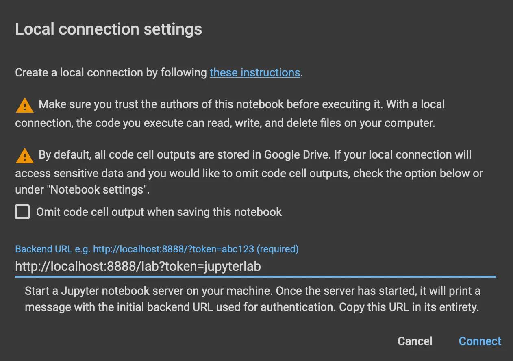
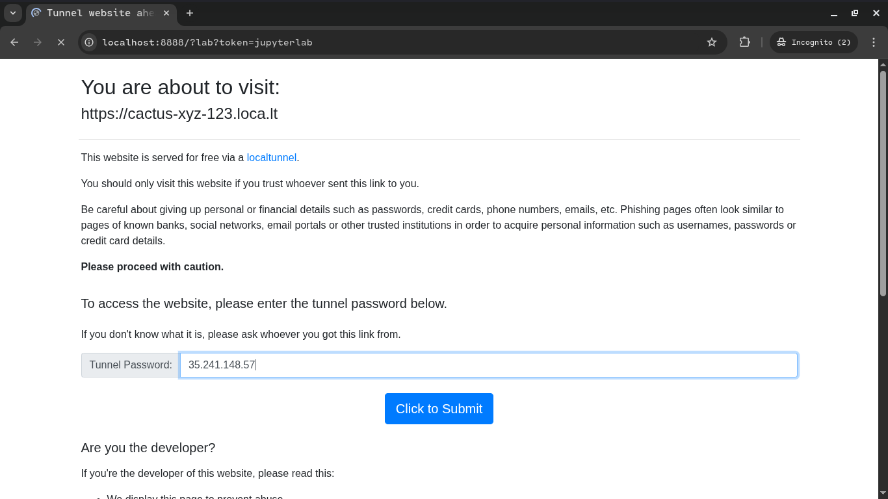
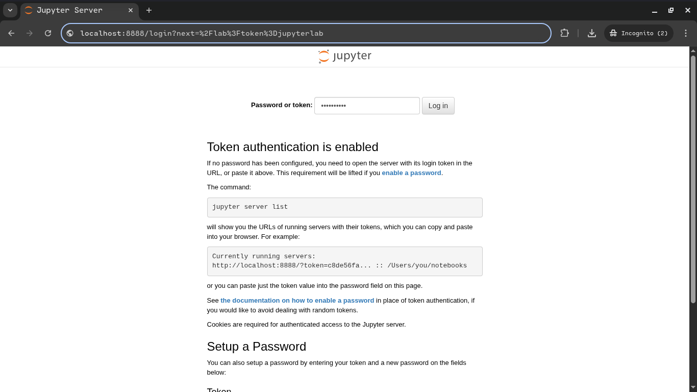

# Running a Google Colab Local Runtime in a Remote Docker Container

## TL;DR
- Using tunnelling (localtunnel) to expose our remote machine's jupyter instance.
- On the local we simply proxy requests to `localhost:8888` to our remote machine using (mitmproxy)
- Finally we setup colab to use our local runtime specifying the `http://localhost:8888/lab?token=jupyterlab` url.

If you don't need tunnelling generally you can ssh in to your remote machine, and reverse proxy all requests.
From your local machine in a terminal run:
```
ssh -L 8888:localhost:8889 user@remote-host
```

Anyway `ssh` wasn't on the menu today, let's get started. This is just an alternative to it.


Project IDX uses nix as its package manager, so we'll need to create a `.idx/.dev.nix` file
in your IDX workspace so that docker is installed in it.

## Step 1: On Your Remote machine (project idx in our case)

### 1.a) Creating a `.idx/dev.nix` (Skip if not using IDX)

Create a new workspace (You can choose any template) and follow the prompts.
<br/>
In your workspace folder create a `dev.nix` file in the .idx folder or run these to create it:
```sh
mkdir -p .idx
touch .idx/dev.nix
```

And Paste these or update the contents of `.idx/dev.nix` file:
```nix
{ pkgs, ... }:

{
  # Define the packages you need in your environment
  packages = [
    pkgs.docker # Include the Docker package
  ];

  # Enable the Docker service
  services.docker.enable = true;

  # You can also add environment variables if needed
  env = {};

  # Other configurations can be added here
  # For example, if you need specific IDE extensions:
  # idx.extensions = [
  #   "ms-azuretools.vscode-docker"
  # ];
}
```

You may be prompted to rebuild environment, accept rebuilding, this will restart your workspace with the new packages.

### 1.b) Creating a `Dockerfile`

Copy paste these contents and save the file as `Dockerfile`
```Dockerfile
# Dockerfile
FROM jupyter/datascience-notebook:latest
RUN pip install jupyter_http_over_ws
RUN jupyter server extension enable --py jupyter_http_over_ws
# RUN Rscript -e 'install.packages("psych", repos="https://cloud.r-project.org")'
```

### 1.c) Building the image

```sh
docker build -t zenjupyterlab:latest .
```

### 1.d) Running the docker image
```sh
export REMOTE_PORT=8888
export PROXY_SUBDOMAIN=cactus-xyz-123
```

```sh
docker run -it -v ${PWD:-`pwd`}:${HOME} --rm -p $REMOTE_PORT:$REMOTE_PORT zenjupyterlab:latest \
    start-notebook.sh --ip=0.0.0.0 --no-browser --allow-root \
    --NotebookApp.allow_origin_pat='https://colab.research.google.com|https?://(localhost|127.0.0.1):[0-9]{2,5}' \
    --NotebookApp.port_retries=0 --NotebookApp.token='jupyterlab' \
    --NotebookApp.allow_credentials=True
#   --NotebookApp.disable_check_xsrf=True
```

Note: Here we set `jupyterlab` as our notebook token

### 1.e) Exposing jupyter listening port the port

Open another terminal and run these commands.<br/>
Copy the url that is displayed to you (We'll use it to connect to the remote machine later on).

```sh
npm install -g localtunnel

lt --port $REMOTE_PORT --subdomain $PROXY_SUBDOMAIN
```

Open another terminal and run any of these commands to get you tunnel password (We MAY need it 
when connecting to the remote machine later on).<br/>
Copy the value displayed to you.

```sh
wget -q -O - https://loca.lt/mytunnelpassword
# OR
curl https://loca.lt/mytunnelpassword
```

At this stage our work on the remote machine is done.


## Step 2: On your Local Machine

Install the necessary packages
```sh
pip -m venv .venv
pip install mitmproxy
```

Replace `REMOTE_HOST` with whatever url was displayed to you in the last step (1.e)
```sh
export LOCAL_PORT=8888
export REMOTE_HOST=https://cactus-xzy-123.loca.lt
```
Run the proxy sever
```sh
mitmproxy --mode reverse:$REMOTE_HOST --listen-port $LOCAL_PORT
```
<br/>

**Altenatively:** If you face any issues, you can run mitmproxy with a helper script (Save it as `forwarder.py`)
```py
# forwarder.py
from mitmproxy import http

# Replace this with whatever url was displayed to you on the remote machine 
# in the last step (1.e)
REMOTE = "https://cactus-xyz-123.loca.lt"

def request(flow: http.HTTPFlow) -> None:
    flow.request.host = REMOTE.replace("https://", "").replace("http://", "")
    flow.request.scheme = "https"
    flow.request.port = 443
    flow.request.headers["Host"] = flow.request.host
    flow.request.headers["bypass-tunnel-reminder"] = "1"

    # Optionally rewrite Origin/Referer headers for Colab
    if "Origin" in flow.request.headers:
        flow.request.headers["Origin"] = REMOTE
    if "Referer" in flow.request.headers:
        flow.request.headers["Referer"] = REMOTE

```
Then run mitmproxy with the helper script:
```sh
mitmproxy --mode reverse:$REMOTE_HOST --listen-port $LOCAL_PORT -s forwarder.py
```


## Step 3

Specify the connection url in your colab

<p align="center" width="100%">
   
</p>

Now open a new browser tab on your local machine and vist `http://localhost:8888?lab?token=jupyterlab`
<br/>

**NOTE:**
 - If asked to input the tunnel token, input the token you that was displayed to you in step 1.e
    <br/><br/>
    <p align="center" width="100%">
      
    </p>
    <br/>
 - If asked to input the notebook password or token, input `jupyterlab`
    <br/><br/>
    <p align="center" width="100%">
       
    </p>
    <br/>

Viola! And we're done here. Next!
